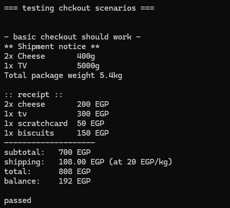
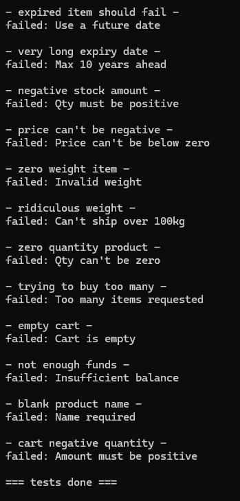

# E-commerce System

A simple e-commerce checkout system built in C# that handles products, shopping carts, and customer transactions with support for perishable items and shipping.

## Features

- **Product Management**: Create products with name, price, and quantity
- **Perishable Items**: Support for items that expire (cheese, biscuits) vs non-perishable (TV, mobile)
- **Shipping System**: Handle shippable items with weight calculations and fees
- **Shopping Cart**: Add products with quantity validation
- **Checkout Process**: Complete transactions with balance checking and receipt generation

## Design Patterns

### Strategy Pattern
The system uses the **Strategy Pattern** for handling different product behaviors:
- `IPerishable` interface with `Perishable` and `NonPerishable` implementations
- `IShippable` interface with `Shippable` and `NonShippable` implementations

This allows products to have different expiration and shipping behaviors without complex inheritance hierarchies.

## SOLID Principles

The code follows several SOLID principles:

- **Single Responsibility**: Each class has one clear purpose (Cart manages items, Customer handles balance, Product encapsulates product data)
- **Open/Closed**: New shipping or perishable strategies can be added without modifying existing code
- **Interface Segregation**: Small, focused interfaces (`IPerishable`, `IShippable`) that clients only implement what they need
- **Dependency Inversion**: Product class depends on abstractions (`IPerishable`, `IShippable`) rather than concrete implementations

## Usage Example

```csharp
var customer = new Customer(1000m);
var cart = new Cart();

var cheese = new Product("Cheese", 100m, 5, 
    new Shippable("Cheese", 0.2), 
    new Perishable(DateTime.Today.AddDays(3)));

var tv = new Product("TV", 300m, 2, 
    new Shippable("TV", 5), 
    new NonPerishable());

cart.Add(cheese, 2);
cart.Add(tv, 1);

new CheckoutService().Checkout(customer, cart);
```

## Test Results

The system includes comprehensive test cases covering various scenarios:



## Error Handling



The system validates:
- Expired products
- Insufficient stock
- Invalid quantities
- Insufficient customer balance
- Empty carts
- Invalid product data (negative prices, weights, etc.)

## Getting Started

1. Clone the repository
2. Open in Visual Studio or your preferred C# IDE
3. Build and run the project
4. Check the console output for test results

---

*Built as part of the Fawry Quantum Internship Challenge*
